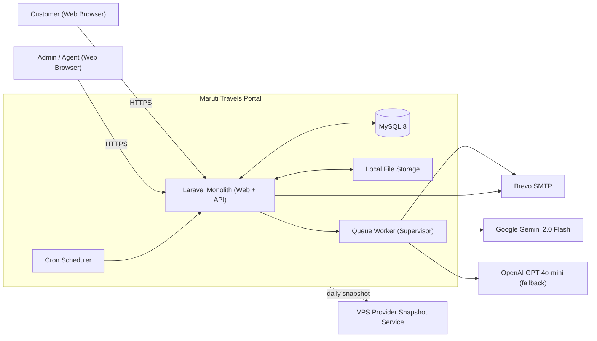
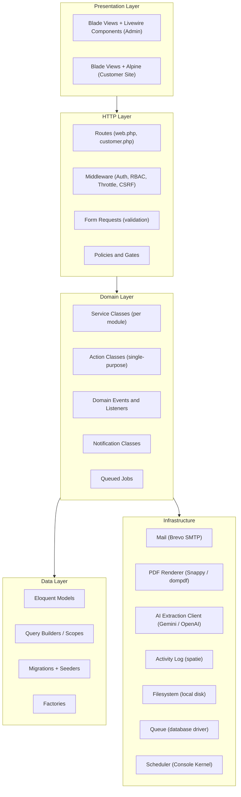
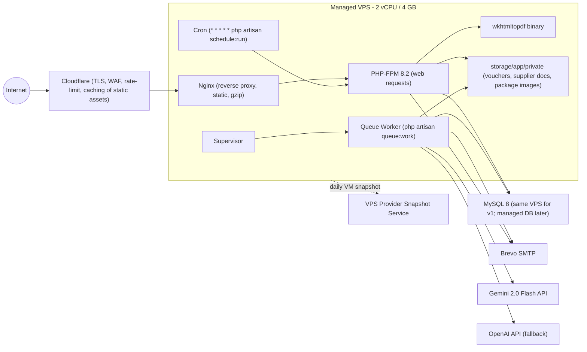
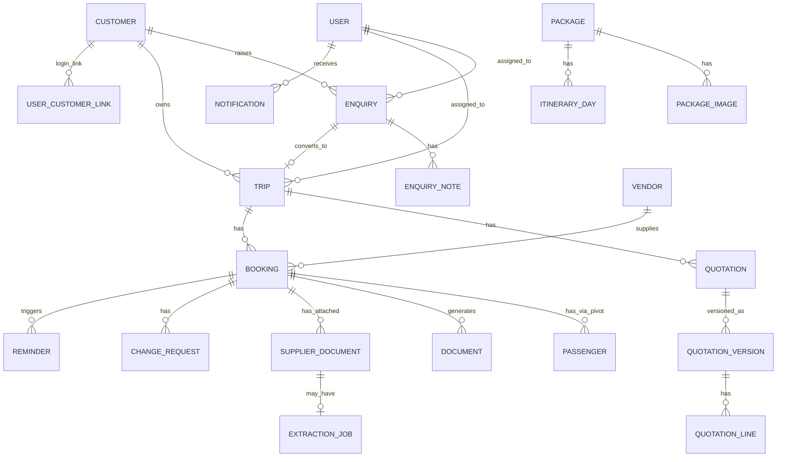
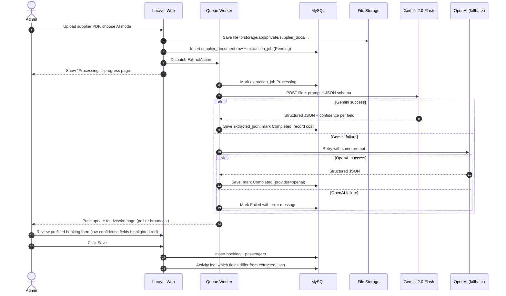
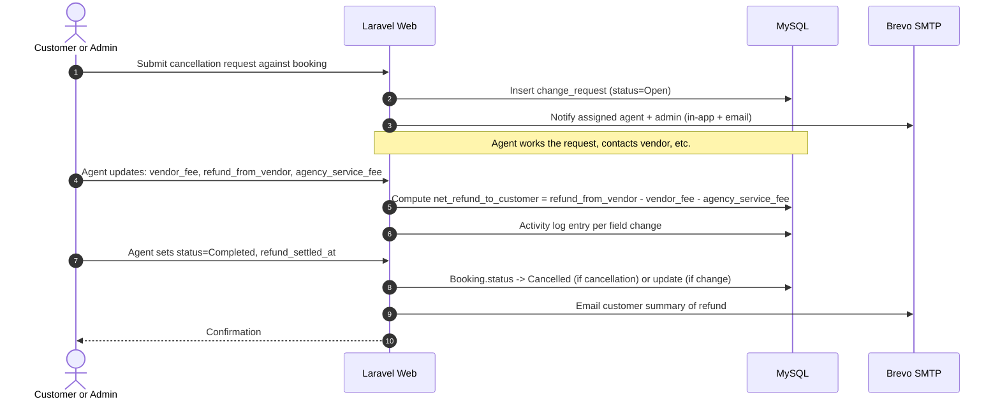
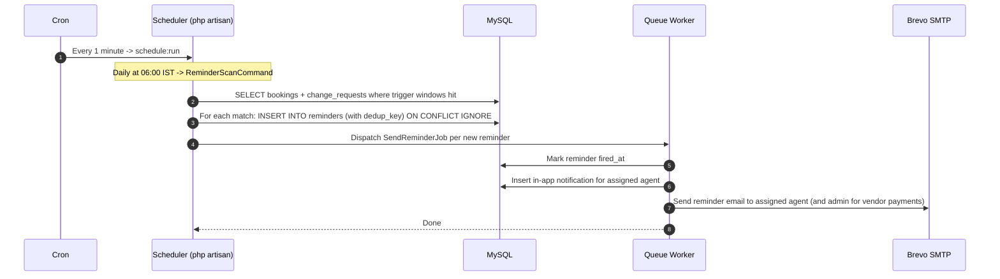

# Maruti Travels — Travel Agency Portal — High-Level Design (v1)

| Field | Value |
| --- | --- |
| Agency | Maruti Travels |
| Document version | 1.0 |
| Date | 2026-05-16 |
| Status | Draft for review |
| Companion document | PRD.md (v1.0) |
| Target release | v1 |

---

## 1. Purpose and References

This High-Level Design (HLD) document translates the requirements captured in `PRD.md` into a concrete architecture, deployment topology, module decomposition, and operational design. It is the primary input to detailed design (LLD), database schema, and implementation work.

This HLD locks in every decision made during the PRD review and stops short of class-level / table-column-level detail; that belongs in the LLD that follows.

References:
- `PRD.md` (v1.0) — functional + non-functional requirements, scope, acceptance criteria.
- `input.md` — original raw requirement notes from Maruti Travels.

## 2. Architectural Style and Drivers

### 2.1 Style
A classic **server-rendered Laravel monolith** running on a single managed VPS, with clear internal layering (HTTP → Domain Services → Eloquent → Infrastructure) and asynchronous work pushed to a Laravel queue. No microservices, no SPA, no separate frontend build. This style is chosen deliberately.

### 2.2 Architectural drivers (ranked)
1. **Time-to-ship**: ~10 weeks for one engineer. Style minimises moving parts.
2. **Maintainability by a single PHP-leaning team**: Laravel + Livewire keeps the entire stack in PHP.
3. **Operational simplicity**: one VPS, one MySQL, one cron, one queue worker, one off-server backup target.
4. **Cost discipline**: managed VPS (~₹1500–3000/month) + Brevo SMTP free tier + ₹300/month AI cap.
5. **Security**: server-rendered Blade with framework-default protections (CSRF, escaping, parameterised queries) reduces attack surface compared to a separate API + SPA.

### 2.3 Decisions locked from the PRD
- Backend: PHP 8.2 + Laravel 11.
- Admin UI: Blade + Livewire 3 + Alpine.js.
- Customer site: Blade + minimal Alpine.js.
- DB: MySQL 8.
- PDF: `barryvdh/laravel-snappy` (primary) with `barryvdh/laravel-dompdf` (fallback).
- Email: Brevo SMTP.
- AI extraction: Google Gemini 2.0 Flash (primary), OpenAI GPT-4o-mini (fallback).
- RBAC: `spatie/laravel-permission`.
- Audit: `spatie/laravel-activitylog` (scoped to Bookings, Quotations, Cancellation/Change Requests, Supplier Documents).
- Excel/CSV: `maatwebsite/excel`.
- Hosting: Cloudways managed Laravel VPS, 2 vCPU / 4 GB (chosen for native deploy, built-in queue/scheduler config, and managed snapshot service).
- Storage: server local disk; nightly off-server backup.
- Anti-malware: none in v1 (residual risk accepted).
- Localisation: English only.

## 3. System Context



External dependencies (full list in §13):
- Brevo SMTP — transactional email delivery.
- Google Gemini API — primary supplier-document extraction.
- OpenAI API — fallback supplier-document extraction.
- VPS provider snapshot service — daily VM-level snapshots of the entire VPS (Cloudways / Hostinger / DigitalOcean built-in feature). No off-server backup in v1; residual risk documented in §14.

## 4. Logical Architecture

The application uses a layered architecture inside the Laravel monolith. Each layer has a single, narrow responsibility, and dependencies flow downward only.



Layer rules:
- Presentation never imports Eloquent models directly except for read-only display; mutations always flow through domain services or actions.
- Domain services receive form-request DTOs or plain arrays, return domain DTOs or models, and emit domain events.
- Listeners and queued jobs handle side-effects: sending email, generating PDFs, calling Gemini, writing activity log entries, dispatching reminders.
- Authorization is enforced in two places (defence in depth): middleware/policies on routes, and explicit gate checks inside services for financial fields.

## 5. Deployment Architecture



### 5.1 Process responsibilities
- **Nginx**: TLS handoff already done at Cloudflare; serves static assets directly from `public/` and forwards PHP requests to PHP-FPM via Unix socket. Configures `client_max_body_size 12M` to match the 10 MB upload cap with margin.
- **PHP-FPM**: handles synchronous web requests. Generates PDFs synchronously when the source data is small (≤ 3 line items / single passenger); enqueues to the background queue otherwise. Threshold tunable in `config/pdf.php`.
- **Supervisor → queue worker**: runs `php artisan queue:work --tries=3 --backoff=10,30,90`; handles email dispatch, AI extraction, reminder fan-out, and any heavy PDFs.
- **Cron**: a single `* * * * *` line invokes `php artisan schedule:run`, which in turn defers to scheduled commands (reminders, backup trigger, queue-restart on deploy).
- **MySQL**: runs locally on the VPS for v1; migration to a managed DB (e.g., DigitalOcean managed MySQL) is a phase-2 candidate when the load profile justifies it.
- **wkhtmltopdf**: installed once at provisioning; absence detected at runtime triggers automatic dompdf fallback.

### 5.2 Environments
- **Production**: single VPS, environment `production`, `APP_DEBUG=false`, optimised autoload + config caches.
- **Local dev**: Laravel Sail or Herd; SQLite/MySQL local; AI calls disabled by default (extraction mode forced to Manual unless `AI_ENABLED=true`).
- **Staging**: not provisioned in v1 (cost-driven decision). Engineer is expected to validate migrations and feature changes locally and to use feature flags for any risky rollout. Staging is a phase-2 candidate once usage justifies the additional ~₹700–1000/month.

## 6. Module / Component Breakdown

The codebase is organised by **bounded module** rather than by Laravel artefact type. Each module owns its routes, controllers, Livewire components, services, models, policies, jobs, and Blade views.

### 6.1 Top-level folder layout (`app/Modules/`)

```
app/Modules/
  Identity/          (users, roles, permissions, auth bootstrapping)
  Customer/          (customer master)
  Vendor/            (vendor master, Admin-only)
  Enquiry/           (enquiry inbox + customer-side form, templates)
  Trip/              (trip container)
  Quotation/         (quotations, versions, line items)
  Booking/           (bookings, passengers, agency PNR, financial fields)
  Voucher/           (voucher generation, drop-and-create)
  SupplierDoc/       (upload, manual mode, AI extraction, jobs)
  ChangeRequest/     (cancellations, flight changes, refunds)
  Package/           (package master, customer-facing browse)
  Document/          (template editor, GST invoice generation)
  Reminder/          (scheduled job, dispatch, dedup)
  Notification/      (in-app bell, email channel)
  Report/            (dashboard widgets, exports)
  CustomerPortal/    (public site, customer dashboard)
  Settings/          (agency settings, GSTIN, branding, AI provider, budget cap)
```

Conventions:
- Each module exposes its public surface via a `Routes.php` file mounted in `RouteServiceProvider`.
- Cross-module calls go through service classes only — modules do not reach into each other's Eloquent models.
- Shared concerns (BaseService, BaseAction, BaseFormRequest, audit traits, money cast, GST calculator) live in `app/Support/`.

### 6.2 Module summary

| Module | Key entities | Key services | External calls |
| --- | --- | --- | --- |
| Identity | User, Role, Permission | AuthService, RoleSyncService | — |
| Customer | Customer | CustomerService, GstinValidator | — |
| Vendor | Vendor | VendorService | — |
| Enquiry | Enquiry, EnquiryNote, EnquiryReplyTemplate | EnquiryService, ReplyTemplateService | Brevo (email) |
| Trip | Trip | TripService | — |
| Quotation | Quotation, QuotationVersion, QuotationLine | QuotationService, GstCalculator, QuotationPdfService | Brevo, PDF |
| Booking | Booking, Passenger | BookingService, PnrAllocator | — |
| Voucher | (uses Booking) | VoucherService, VoucherPdfService | PDF |
| SupplierDoc | SupplierDocument, ExtractionJob | SupplierDocService, ExtractAction (queued), GeminiClient, OpenAiClient | Gemini / OpenAI |
| ChangeRequest | ChangeRequest | ChangeRequestService, RefundCalculator | Brevo |
| Package | Package, PackageImage, ItineraryDay | PackageService | — |
| Document | EmailTemplate, TemplateSetting, Invoice | DocumentTemplateService, InvoiceService | PDF |
| Reminder | Reminder | ReminderScheduler (artisan), ReminderDispatcher | Brevo, in-app |
| Notification | Notification (in-app) | NotificationService | — |
| Report | (read-only across modules) | ReportQueryService, ExcelExporter | — |
| CustomerPortal | (uses Customer/Trip/Booking) | CustomerScopedQuery (policy-bound) | — |
| Settings | AgencySetting | SettingsService, AiBudgetTracker | — |

## 7. Data Architecture

### 7.1 Detailed ERD (logical, key entities only)



### 7.2 Key columns by entity (selected highlights, not exhaustive)

- `users`: `id`, `name`, `email` (unique), `password`, `role` via spatie pivot, `email_verified_at`, `is_active`.
- `customers`: `id`, `name`, `phone` (unique), `email` (unique), `gstin` (nullable, regex-validated), `state`, `pincode`, `address`, `dob`, `anniversary`, `pan`, plus `created_by`, `updated_by`.
- `vendors`: `id`, `name`, `code`, `contact_person`, `email`, `phone`, `gstin`, `payment_terms`, `notes`. Admin-only.
- `enquiries`: `id`, `customer_id`, `assigned_user_id`, `enquiry_type`, `travel_from`, `travel_to`, `origin`, `destination`, `pax_adult`, `pax_child`, `pax_infant`, `budget_min`, `budget_max`, `status`, `created_via`, `source` (nullable enum).
- `trips`: `id`, `customer_id`, `name`, `primary_destination`, `travel_start`, `travel_end`, `status`, `notes`, `assigned_user_id`.
- `quotations`: `id`, `trip_id`, `current_version_id`, `validity_date`, `status`.
- `quotation_versions`: `id`, `quotation_id`, `version_number`, `subtotal`, `discount_amount`, `cgst`, `sgst`, `igst`, `grand_total`, `terms`, `customer_notes`, `pdf_path`, `sent_at`, `created_by`.
- `quotation_lines`: `id`, `quotation_version_id`, `line_type`, `description`, `structured_data` (JSON for type-specific fields), `quantity`, `unit_rate`, `amount`, plus Admin-only `vendor_id`, `purchase_cost`, `margin`.
- `bookings`: `id`, `trip_id`, `customer_id`, `booking_type`, `booking_ref`, `agency_pnr`, `vendor_id`, `vendor_pnr`, `sale_amount`, `purchase_cost`, `margin`, `payment_status`, `customer_payment_due`, `vendor_payment_due`, `status`, plus type-specific JSON for flight/hotel/package details, plus snapshot fields.
- `passengers`: `id`, plus per-passenger fields. Linked to bookings via `booking_passenger` pivot with `is_lead` flag.
- `change_requests`: `id`, `booking_id`, `request_type`, `requested_by_user_id`, `customer_facing_reason`, `status`, `vendor_fee`, `refund_from_vendor`, `agency_service_fee`, `net_refund_to_customer`, `refund_mode`, `refund_settled_at`.
- `documents`: `id`, `booking_id` (nullable), `quotation_version_id` (nullable), `doc_type`, `version_number`, `pdf_path`, `generated_by`, `generated_at`. Stores generated quotation/voucher/invoice PDFs with version retention.
- `supplier_documents`: `id`, `booking_id` (nullable for the standalone-flow staging row), `doc_type` (`flight` / `hotel`), `supplier_name`, `original_filename`, `storage_path`, `mime`, `size_bytes`, `sha256`, `extraction_mode` (`manual` / `ai`), `uploaded_by`, `uploaded_at`.
- `extraction_jobs`: `id`, `supplier_document_id`, `provider`, `model`, `status`, `request_started_at`, `request_completed_at`, `response_time_ms`, `prompt_tokens`, `completion_tokens`, `estimated_cost_inr`, `extracted_json`, `error_message`. The extracted JSON is retained to allow audit comparison with what admin saved.
- `reminders`: `id`, `booking_id`, `reminder_type`, `trigger_at`, `fired_at` (nullable), `dedup_key` (unique). Dedup key combines booking id + reminder type + day-of-trigger.
- `notifications` (Laravel default `notifications` table): polymorphic `notifiable_id` / `notifiable_type`, `data` JSON.
- `agency_settings`: single-row table, **column-per-setting layout** (simpler to query, keeps validation in the schema). Columns include GSTIN, registered state, GST rates per service type, AI provider, AI model, AI monthly budget cap (INR), reminder lead times (days), branding fields (logo path, accent colour hex), default T&Cs.
- `activity_log` (spatie): polymorphic `subject`, `causer`, `description`, `properties` JSON containing the field-level diff.

### 7.3 Indexing strategy (v1 baseline)

- `customers (email)`, `customers (phone)` — unique.
- `enquiries (status, assigned_user_id)`, `enquiries (created_at)`.
- `trips (customer_id)`, `trips (status, travel_start)`.
- `bookings (trip_id)`, `bookings (status, customer_payment_due)`, `bookings (status, vendor_payment_due)`, `bookings (booking_ref)` unique.
- `quotation_versions (quotation_id, version_number)` unique composite.
- `reminders (dedup_key)` unique, `reminders (trigger_at, fired_at)`.
- `activity_log (subject_type, subject_id)` and the package's default index.

### 7.4 Money and date semantics
- All monetary values stored as `DECIMAL(12,2)` in INR; GST percentages as `DECIMAL(5,2)`. No floats.
- Dates stored in UTC; rendered in `Asia/Kolkata` timezone (`APP_TIMEZONE=Asia/Kolkata`).
- Travel dates and check-in/out times stored with timezone information when supplied; otherwise interpreted as Asia/Kolkata.

## 8. Key Sequence Flows

### 8.1 Enquiry to Quotation to Booking to Voucher (happy path)

```mermaid
sequenceDiagram
    autonumber
    actor Customer
    actor Agent
    participant Web as Laravel Web
    participant Q as Queue Worker
    participant DB as MySQL
    participant Mail as Brevo SMTP

    Customer->>Web: Submit enquiry from package page
    Web->>DB: Insert enquiry (auto-create customer if new)
    Web->>Mail: Confirmation email to customer
    Web-->>Customer: Thank-you screen

    Agent->>Web: Open enquiry, click Convert to Trip + Quotation
    Web->>DB: Create trip, quotation v1, lines
    Agent->>Web: Click Generate PDF + Email
    Web->>Q: Dispatch QuotationPdfJob, EmailQuotationJob
    Q->>Q: Render PDF (Snappy)
    Q->>DB: Save document metadata + path
    Q->>Mail: Send quotation with PDF attached
    Q-->>Agent: Bell notification "Quotation v1 sent"

    Agent->>Web: Mark Quotation Accepted
    Web->>DB: Trip status -> Confirmed; prompt create bookings
    Agent->>Web: Create flight + hotel + package bookings
    Web->>DB: Insert bookings, attach passengers
    Agent->>Web: Enter agency PNR + vendor PNR for each
    Agent->>Web: Click Generate Voucher per booking
    Web->>Q: Dispatch VoucherPdfJob (per booking)
    Q->>Q: Render voucher PDF
    Q->>DB: Save document row (versioned)
    Q->>Mail: Email voucher to customer
    Q-->>Agent: Bell notification "Voucher generated"

    Note over Web,DB: Activity log entries written at every<br/>create/update on Quotation, Booking, Passenger
```

### 8.2 Supplier document upload — AI extraction mode



### 8.3 Cancellation flow



### 8.4 Reminder generation (daily)



### 8.5 Audit log capture

Every write to a tracked entity (Booking, Passenger, Quotation, QuotationVersion, QuotationLine, ChangeRequest, SupplierDocument) flows through Eloquent model events that the spatie package hooks into. The package writes one `activity_log` row per change with:
- `subject` — polymorphic ref to the changed model.
- `causer` — the authenticated user (Admin or Agent).
- `description` — `created` / `updated` / `deleted`.
- `properties` — `old` and `attributes` maps containing only the fields configured for tracking on that model.

The History tab on the entity detail page queries `activity_log where subject_type = ? and subject_id = ? order by created_at desc`, scoped to Admin role via a Laravel policy.

## 9. Cross-Cutting Concerns

### 9.1 Authentication and sessions
- Email + password for all roles, via Laravel Breeze + Fortify.
- Email verification mandatory before login (both customer and admin sides).
- Password reset via signed expiring email link.
- Session driver: database; cookie attributes `secure`, `httponly`, `same_site=lax`.
- Login throttle: 5 attempts/min per IP and per email (`ThrottleRequests` + custom `RateLimiter::for('login', ...)`).
- Session ID regenerated on login (`auth()->login` + `regenerateToken()`).

### 9.2 Authorization (RBAC)
- Two roles seeded by migration: `admin`, `agent`.
- Route-level: middleware groups apply role check (`role:admin` for vendor master, sales+profit report, template editor, settings, audit history).
- Resource-level: Laravel policies for every domain entity. Customer policies are owner-scoped.
- **Financial-field hiding for Agents** is implemented at three layers:
  1. Form requests strip `purchase_cost`, `margin`, `vendor_id` from the validated input when the user is an Agent.
  2. Eloquent global scopes / accessors return null/0 for those columns when the actor is an Agent (including in API responses).
  3. Blade views check `@can('viewFinancials', $booking)` before rendering the columns and the History tab.

### 9.3 Audit logging
- spatie/laravel-activitylog with the `LogsActivity` trait on Booking, Passenger, Quotation, QuotationVersion, QuotationLine, ChangeRequest, SupplierDocument.
- Each model declares `getActivitylogOptions()` listing trackable fields and `dontSubmitEmptyLogs()` semantics.
- Activity log entries are immutable — no update/delete endpoints; admin policies explicitly deny those operations.
- Retention: indefinite in v1.

### 9.4 Background jobs and scheduling
- Single queue worker (`default` queue). For v1, separating queues by priority is unnecessary.
- Queue driver: `database` (no Redis on the VPS for v1; can switch to Redis later by changing one env var).
- Worker config: `--tries=3 --backoff=10,30,90 --timeout=120`. AI extraction job overrides timeout to 90 seconds (Gemini calls typically resolve in 2–10 s).
- Scheduler: `Console\Kernel::schedule()` registers `reminder:scan` daily at 06:00 IST, `backup:run` daily at 02:00 IST, `queue:restart` on deploy.
- Failed jobs surface in the standard `failed_jobs` table; admin sees a "Failed background jobs" widget on dashboard with retry/discard.

### 9.5 Email
- Driver: SMTP, host `smtp-relay.brevo.com`, port 587, STARTTLS, auth username + API key from `.env`.
- All emails routed through Laravel `Notification` classes for templating and queueing.
- Bounces and complaints: tracked at Brevo dashboard; v1 does not auto-suppress in-app, manual review.

### 9.6 PDF generation
- Primary: laravel-snappy → wkhtmltopdf binary at `/usr/local/bin/wkhtmltopdf`.
- Runtime fallback: a `PdfRenderer` interface with two implementations; the factory probes `wkhtmltopdf --version` once at boot, caches the result in `apc`/`array` cache, and selects accordingly.
- Templates are Blade views in `resources/views/pdfs/{document_type}.blade.php`, receiving a typed view-model.
- All PDFs written to `storage/app/private/documents/{entity}/{id}/{version}.pdf` with deterministic paths to allow regeneration ("drop and create") to keep prior versions.

### 9.7 File storage
- Disk `private` mapped to `storage/app/private` with directory layout:
  ```
  storage/app/private/
    documents/quotations/{quotation_id}/v{n}.pdf
    documents/vouchers/{booking_id}/v{n}.pdf
    documents/invoices/{booking_id}/v{n}.pdf
    supplier_docs/{booking_id}/{uuid}.{ext}
    package_images/{package_id}/{uuid}.{ext}
    enquiry_attachments/{enquiry_id}/{uuid}.{ext}
    branding/logo.{ext}
  ```
- Downloads served via `Route::get('files/{token}', FileController@download)` with a signed URL (Laravel `URL::temporarySignedRoute`) and a policy check. Files are never reachable directly from `public/`.

### 9.8 Error handling
- Custom `Handler::render()` returns:
  - HTML error pages for web (`404.blade.php`, `403.blade.php`, `500.blade.php`) with Maruti Travels branding.
  - JSON envelopes for Livewire/AJAX endpoints.
- Stack traces never reach the user; full details go to logs (`stack` channel: `daily` + `stderr`).
- External error tracking (Sentry / Bugsnag) is **deferred to phase 2**. v1 visibility comes from Laravel daily logs, the failed-jobs widget on the admin dashboard, and the System Health page (§16.3).

### 9.9 Logging and observability
- `daily` log channel with 14-day retention on disk.
- Structured logs (JSON) for queue jobs and AI extraction (provider, model, response time, cost).
- A "System health" page (Admin only) shows: failed-job count, last reminder run timestamp, last backup timestamp, Brevo last-send result, AI extraction success rate (last 30 days), monthly AI spend so far.
- v1 does not include APM (NewRelic / Datadog); revisit once load justifies.

### 9.10 Backups and DR
- v1 relies entirely on the **Cloudways built-in snapshot service** (one-click VM-level snapshots managed from the Cloudways console).
- Snapshot frequency: daily, configured in the Cloudways panel. Retention: at least 7 daily snapshots. Cost is included in or marginal to the Cloudways plan.
- Application-level backup (a `php artisan backup:run` command using `spatie/laravel-backup`) is left ready in the repository but disabled in v1; it can be enabled at any time once an off-server destination is selected.
- Restore procedure: provider console → restore latest snapshot to a new VM → repoint DNS via Cloudflare. Documented in the operational runbook (§13).
- **RPO: up to 24 hours** (snapshot frequency). **RTO target: 2–4 hours** from snapshot rollback to production traffic.
- **Residual risk** (also tracked in §14): if the entire VPS provider has a catastrophic failure, suffers a regional outage longer than expected, or the Maruti Travels account is compromised at the provider, all data may be lost. Off-server backup is a phase-2 candidate. This risk has been accepted for v1.

## 10. Security Architecture

| Concern | Control |
| --- | --- |
| Transport | TLS terminated at Cloudflare; HTTPS-only; HSTS header `max-age=31536000; includeSubDomains`. |
| CSRF | Laravel default CSRF token on all POST/PUT/PATCH/DELETE forms. Livewire and Alpine respect the same token. |
| XSS | All dynamic data rendered via Blade `{{ $value }}` (auto-escaped). `{!! !!}` only used for sanitised rich text via HTMLPurifier (`mews/purifier`). |
| SQL injection | Eloquent / parameter-bound queries throughout. No raw concatenated SQL anywhere in the codebase. |
| Auth | Email + password, email verification, login throttling, secure cookies, session regeneration on login, 2FA design-ready. |
| Authorization | Spatie role middleware + per-resource policies + financial-field hiding (three-layer). |
| File uploads | MIME-sniffed, extension allow-listed, size-capped, server-generated filenames, stored outside `public/`, served via signed routes only. |
| AI provider calls | HTTPS only, `verify=true`, JSON schema validation on response, API key in `.env` only, never logged. |
| Secrets | `.env` permissions `0600`, owned by deploy user; never committed; deploy uses `envoyer`-style atomic deploy or Forge-managed. |
| Audit | Immutable activity log on financial / state-changing entities. |
| GSTIN | Regex-validated `^[0-9]{2}[A-Z]{5}[0-9]{4}[A-Z]{1}[1-9A-Z]{1}Z[0-9A-Z]{1}$` on save. |
| Rate limiting | Login 5/min per IP+email; package list 60/min; supplier-doc upload 10/hour per user; AI extraction 30/hour per user. |
| Data at rest | No mandatory disk encryption for v1; whatever Cloudways' chosen sub-provider supplies by default. DB-column-level encryption only for password hashes (bcrypt). Revisit if contractual requirements demand encryption. |
| Data minimisation | Customer-side responses never include vendor/cost/margin or supplier-doc content. |
| Residual risks documented | No anti-malware on uploads (accepted); no admin 2FA in v1 (deferred). |

## 11. Performance and Scalability

### 11.1 Targets (from PRD)
- Dashboard initial render ≤ 2s.
- Lists with up to 5,000 records ≤ 1.5s on default page size 25.
- PDF generation ≤ 5s synchronously; queued otherwise.

### 11.2 Sizing for v1 (≤ 5 concurrent users, ≤ 5,000 bookings/year)
- VPS: 2 vCPU / 4 GB RAM.
- Approximate memory split: PHP-FPM pool 1 GB, MySQL 1.5 GB, Nginx 100 MB, queue worker 200 MB, OS + headroom 1.2 GB.
- DB rough estimate at year 5: 25,000 bookings + 50,000 passengers + 75,000 quotation lines + ~500,000 activity_log rows → ~3–5 GB. Comfortable on a 50 GB VPS disk.
- Queue worker concurrency: 1 process for v1 is sufficient; raise to 2 if AI extractions and PDF jobs contend.

### 11.3 Caching strategy
- Config + route + view caches enabled in production (`php artisan optimize` post-deploy).
- Application-level cache (Laravel default, `file` driver in v1; switch to Redis later) for: agency settings, GST rates, AI provider config, email templates. Invalidated on save.
- Query cache: not used in v1 (premature complexity).
- Asset cache: Cloudflare for static assets (`public/build/...`).

### 11.4 Scaling beyond v1
- Vertical: bump to 4 vCPU / 8 GB.
- Horizontal: extract MySQL to managed DB; add a second app VPS behind a load balancer; switch session and queue drivers to Redis.
- Multi-tenant / multi-branch: single-tenant in v1; phase 4 in PRD.

## 12. External Dependencies

| Dependency | Purpose | Provider | Failure mode handling |
| --- | --- | --- | --- |
| Brevo SMTP | All transactional email | brevo.com | If SMTP fails, job retries 3 times with backoff; persistent failure surfaces in failed-jobs widget; admin can re-trigger from booking detail. |
| Gemini API | Primary AI extraction | ai.google.dev | On failure, ExtractAction retries with OpenAI fallback automatically; on both failing, extraction_job marked Failed and admin can switch to Manual mode. |
| OpenAI API | Fallback AI extraction | platform.openai.com | Same as above. If both keys are missing/invalid, AI mode toggle is disabled in UI. |
| Cloudflare | TLS, WAF, DNS | cloudflare.com | If Cloudflare is down, direct DNS fallback is documented for emergency access. |
| Cloudways snapshot service | Daily VM snapshots; sole backup mechanism in v1 | Cloudways (built-in feature) | Snapshot retention configured in Cloudways panel; admin verifies a recent snapshot exists weekly. Residual risk if Cloudways account is compromised or has a regional outage — accepted for v1. |

API keys, hostnames, and secret rotation policy live in `Settings/AgencySetting` (where applicable) and `.env` (always).

## 13. Operational Runbook (high level)

- **Deploy** via the **Cloudways native Git deployment** integrated with the application. Push to the `main` branch on the configured Git remote → Cloudways pulls, installs, and runs the post-deploy hook script. The hook script runs: `composer install --no-dev --optimize-autoloader`, `npm ci && npm run build`, `php artisan migrate --force`, `php artisan optimize`, `php artisan queue:restart`. Cloudways manages PHP-FPM reload, queue worker (Supervisor), and scheduler entries from its panel.
- **Rolling updates** are not implemented (single VPS). Brief downtime (~5–10 s) acceptable for v1; communicated via maintenance page (`php artisan down`).
- **Monitoring** — UptimeRobot free tier hits `/healthz` every 5 minutes.
- **Alerts** — email to admin on: 2+ failed-job streak, backup failure, AI 30-day success rate below 90%, monthly AI spend ≥ 80% of cap.
- **On-call** — single engineer in v1; runbook documents how to: tail logs, restart queue worker, restart Nginx/PHP-FPM, restore latest backup, rotate API keys.

## 14. Risks and Mitigations

| Risk | Likelihood | Impact | Mitigation |
| --- | --- | --- | --- |
| Single VPS is a single point of failure | Medium | High | VPS provider snapshot rollback only in v1 (no off-server backup). Documented residual risk; phase-2 candidate to add off-server backup + managed DB + second app server. |
| VPS provider account loss / regional catastrophic failure | Low | Critical | No mitigation in v1 (residual risk accepted). Phase-2 plan: nightly DB+storage backup to a different provider (Wasabi / B2 / DO Spaces). Until then, treat the VPS provider account as a critical credential; enable provider-side 2FA and maintain account recovery info. |
| AI provider API outage | Medium | Low | Two-provider fallback; Manual mode always available; budget cap prevents runaway charges. |
| AI extraction inaccuracy on uncommon supplier formats | Medium | Low | Mandatory human review; low-confidence highlighting; phase-2 plan for template parsers. |
| wkhtmltopdf binary missing or upgraded incompatibly | Low | Medium | Runtime probe + dompdf fallback; staging mirrors production. |
| No anti-malware on uploads | Low | High | Strict MIME / extension / size validation; files stored outside web root and served via signed routes; revisit in phase 2. |
| Small team / single engineer | High | Medium | HLD + LLD + tests; aggressive use of off-the-shelf packages (spatie, maatwebsite, breeze) to reduce custom code. |
| GST rule change by GoI | Medium | Medium | Tax rates configurable in agency settings, not hardcoded; templates parameterised. |
| Database size growth from indefinite audit log retention | Low | Low | Monitoring of DB size; phase-2 retention policy if growth becomes a concern. |

## 15. Pending Items (from PRD §10)

Pending owner input only — no architectural unknowns remain:

- #2 Maruti Travels GSTIN + registered state.
- #3 GST rates per service type (CA confirmation).
- #6 Branding assets (logo, address, contact, T&Cs, accent colour).
- #15 Top 3–5 supplier portals for AI extraction sample-set testing.

These do not block architecture or early development, but they block: M8 (Documents engine — needs branding), M11 (Supplier docs + AI — needs sample docs from listed portals), and any GST-bearing PDF going to a real customer.

## 16. Appendix

### 16.1 Required environment variables (selected)

```
APP_NAME="Maruti Travels"
APP_ENV=production
APP_KEY=
APP_DEBUG=false
APP_URL=https://portal.marutitravels.example  # placeholder; substitute actual domain at provisioning time. Ensure registrar account is in Maruti Travels' name.
APP_TIMEZONE=Asia/Kolkata

DB_CONNECTION=mysql
DB_HOST=127.0.0.1
DB_DATABASE=maruti_portal
DB_USERNAME=
DB_PASSWORD=

QUEUE_CONNECTION=database
SESSION_DRIVER=database
CACHE_DRIVER=file

MAIL_MAILER=smtp
MAIL_HOST=smtp-relay.brevo.com
MAIL_PORT=587
MAIL_USERNAME=
MAIL_PASSWORD=
MAIL_FROM_ADDRESS="bookings@marutitravels.example"
MAIL_FROM_NAME="Maruti Travels"

AI_PROVIDER_PRIMARY=gemini
AI_PROVIDER_FALLBACK=openai
GEMINI_API_KEY=
GEMINI_MODEL=gemini-2.0-flash
OPENAI_API_KEY=
OPENAI_MODEL=gpt-4o-mini
AI_MONTHLY_CAP_INR=300

SNAPPY_PDF_BINARY=/usr/local/bin/wkhtmltopdf

# Off-server backup is disabled in v1; relying on VPS provider snapshots.
# Variables retained for future activation:
# BACKUP_S3_ENDPOINT=
# BACKUP_S3_BUCKET=
# BACKUP_S3_KEY=
# BACKUP_S3_SECRET=
```

### 16.2 Ports and protocols
- 443 (HTTPS, public, via Cloudflare).
- 80 (HTTP → HTTPS redirect only).
- 22 (SSH, restricted to admin IPs at the VPS firewall level).
- 3306 (MySQL, bound to localhost only — not exposed publicly).

### 16.3 Health endpoints
- `GET /healthz` — returns 200 with JSON body `{ "status": "ok", "db": "ok", "queue_lag_seconds": N }`. Used by uptime monitor; does not require auth.
- `GET /admin/system-health` — full operational dashboard (Admin only).

### 16.4 Document conventions used in this HLD

- **Bounded module**: a self-contained slice of the codebase under `app/Modules/` corresponding to one PRD functional area.
- **Service class**: orchestrates use cases for a module; called by HTTP / Livewire entry points.
- **Action class**: single-purpose unit of work, often queueable.
- **Drop and create**: regenerate a voucher PDF preserving prior versions (defined in PRD glossary).
