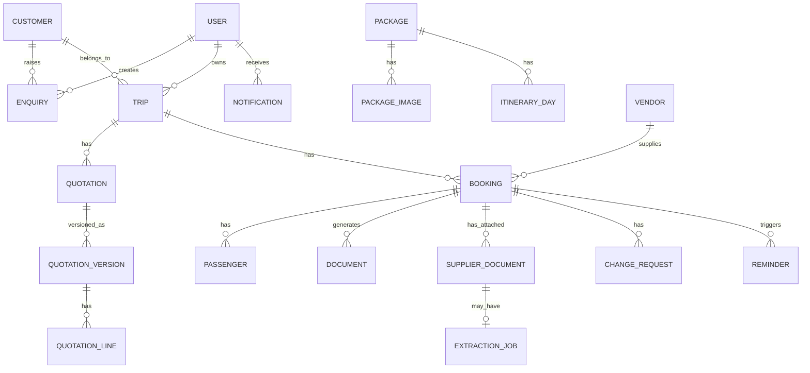

# Maruti Travels — Travel Agency Portal — Product Requirements Document (v1)

| Field | Value |
| --- | --- |
| Agency | Maruti Travels |
| Document version | 1.0 |
| Date | 2026-05-16 |
| Status | Draft for review |
| Owner | (to be assigned) |
| Target release | v1 |

---

## 1. Background and Problem Statement

**Maruti Travels** runs a domestic + international travel business across flight ticketing, hotel bookings, and travel packages. The majority of customers travel within India, with a smaller international segment. Customer data, enquiries, quotations, bookings, vouchers, and vendor payments are currently managed across spreadsheets, WhatsApp, and email. This causes:

- Inconsistent voucher/quotation formats sent to customers.
- No single source of truth for customer history, GSTIN, or trip status.
- Manual tracking of vendor payments and customer payments leading to missed deadlines.
- No proactive reminders for upcoming travel (web check-in, reconfirmation).
- No structured access control between owners (who see profit/cost) and operational staff.

This portal replaces those workflows for Maruti Travels with a unified web application and adds a thin customer-facing site so customers can self-serve their own trip information.

## 2. Goals and Non-Goals

### 2.1 Goals (v1)
- Single internal portal for the entire enquiry → quotation → booking → voucher → cancellation lifecycle.
- Standardised, branded PDFs for quotation, flight ticket voucher, hotel voucher, package voucher, and GST invoice.
- Per-booking purchase cost / sale price / profit margin capture, visible only to Admin role.
- Customer-facing lite site: signup, package browsing, raise enquiry, view own trips and download own vouchers.
- Reminder engine for travel events and payment dues (customer + vendor), in-app + email.
- Operational dashboards and core exportable reports.

### 2.2 Non-goals (deferred to phase 2+)
- Online payment collection from customers (Razorpay / Stripe / etc.).
- Live flight/hotel search and booking via GDS or third-party APIs (Tripjack, TBO, IRCTC, etc.).
- WhatsApp Business API, SMS gateway, AI chatbot or automated reply.
- Series ticket inventory pulled from external sites.
- Multi-branch isolation, full accounting (vendor/customer ledgers, daybook, journal), Tally/ERP integration.
- Field-level audit log, marketing automation, SEO automation.

## 3. Personas and Roles

| Role | Description | Key permissions |
| --- | --- | --- |
| Admin (Owner) | Maruti Travels owner / senior manager | Full access to all modules including financial fields (purchase cost, margin, vendor payment), reports with revenue/profit, vendor masters, user management, template editor. |
| Agent / Staff | Maruti Travels operational staff handling customers and bookings | Full operational access (customers, enquiries, trips, quotations, bookings, vouchers, cancellations, reminders). Vendor cost, profit margin, and vendor payment fields are hidden in UI and stripped from API responses. Cannot access "Sales & profit" report or vendor master CRUD. |
| Customer | End customer of Maruti Travels | Self-signup; scoped to own data only — own profile, own enquiries, own trips, own bookings, own documents. Browses public packages. |

Authorization implemented via Laravel policies/gates; financial-field hiding enforced at controller and view layers (defence in depth).

## 4. Scope Summary

| Module | In v1 | Notes |
| --- | --- | --- |
| Customer master | Yes | Created via signup, admin entry, or auto from enquiry. |
| Enquiries | Yes | Customer- and admin-initiated, with standard reply templates. |
| Trip container | Yes | Groups quotations + bookings + cancellations per journey. |
| Quotations | Yes | Versioned, multi-line, GST auto-calc, PDF + email. |
| Bookings | Yes | Multi-pax; one per service (flight / hotel / package). |
| Vouchers | Yes | Flight ticket, hotel, package; "drop and create" with version retention. |
| Supplier doc upload + conversion | Yes | Upload supplier-issued flight tickets / hotel vouchers; manual or AI-assisted data extraction; re-issue in Maruti Travels branded format. |
| GST Invoice | Yes | Generated against confirmed booking. |
| Cancellation / change requests | Yes | With refund tracking; no auto refund-note PDF in v1. |
| Vendor master | Yes | Admin-only; used as dropdown source on bookings. |
| Standard packages | Yes | With itinerary and gallery; published to customer site. |
| Reminders engine | Yes | Travel + customer payment + vendor payment; in-app + email. |
| Dashboard + reports | Yes | Admin variant has revenue/profit; Agent variant does not. |
| Customer portal (lite) | Yes | Signup, packages, enquiries, view own trips/vouchers. |
| Online payments | No | Phase 2. |
| Live flight/hotel API | No | Phase 2. |
| WhatsApp / SMS / AI chatbot replies | No | Phase 2. (AI for supplier-document extraction is in v1 — see §5.12.) |
| Audit log (field-level) | Partial | Field-level history on Bookings, Quotations, and Cancellation/Change Requests, Admin-only History tab. Other tables: `created_by` / `updated_by` only. |

## 5. Functional Requirements

### 5.1 Customer Management

**Fields**: name, phone (primary, unique), alternate phone, email (unique), address (line 1, line 2, city, state, pincode, country), date of birth, anniversary, GSTIN (optional, 15-char regex validated), company name (required if GSTIN present), PAN (optional), notes, tags, `created_at`, `created_by`.

**Creation paths**:
1. Customer self-signup via public site.
2. Admin manual creation.
3. Auto-creation when an enquiry is submitted by a non-existing email/phone.

**Customer detail screen** shows tabs: Profile, Enquiries, Trips, Bookings, Documents, Upcoming travels, Payments.

**Search**: by name, phone, email, GSTIN; pagination on list view.

### 5.2 Enquiry Management

**Fields**: customer (existing or new — auto-create), enquiry type (Flight / Hotel / Package / Mixed), travel dates (from/to), origin, destination, pax count (adults / children / infants), budget range, special requirements, status (`New` / `In Progress` / `Quoted` / `Converted` / `Lost` / `Cancelled`), assigned agent, created via (`Admin entry` / `Customer portal`), source (`Website` / `Walk-in` / `Phone` / `Referral` / `WhatsApp` / `Other` — optional; auto-set to `Website` for customer-portal enquiries), notes timeline, attachments (optional, image/PDF, ≤ 5 MB each, ≤ 5 files).

**Customer-side**: form available from any package detail page or "Raise enquiry" CTA in customer dashboard. Pre-fills customer profile data.

**Admin-side**: inbox with filters (status, agent, date range, type), bulk-assign, status pipeline, conversion to trip + quotation in one click.

**Standard reply templates**: admin can save reusable email templates (rich text + placeholders). One-click "Send template reply" against an enquiry, logged in the timeline.

### 5.3 Trip Container

**Purpose**: group all bookings, quotations, and cancellations for one customer journey under a single roof.

**Fields**: customer, trip name (auto-generated like `Goa - Dec 2026`, editable), primary destination, travel start date, travel end date, status (`Planning` / `Quoted` / `Confirmed` / `Travelling` / `Completed` / `Cancelled`), notes.

**Origination**: from an accepted enquiry (auto-converted on first quotation) OR created standalone by admin.

**Detail view** aggregates: all quotation versions, all bookings (flight/hotel/package), cancellation/change requests, all generated documents, all reminders, payment status summary.

### 5.4 Quotation

- Created against a Trip.
- **Versioning**: each quotation is immutable once sent; edits create a new version (`v1`, `v2`, `v3`, …). All versions visible in trip history.
- **Header fields**: trip ref, version number, validity date, terms & conditions (configurable default in agency settings), customer-facing notes.
- **Line items** (1..N per quotation):
  - Type: `Flight` / `Hotel` / `Package` / `Other`.
  - Description: free text plus structured fields per type.
  - Quantity, unit rate, line amount.
  - Type-specific structured fields:
    - Flight: sector (from–to), travel date, airline, class, pax count.
    - Hotel: hotel name, city, check-in, check-out, room type, meal plan, no. of rooms, no. of nights.
    - Package: package ref (from package master) or free-form, departure date, pax count.
  - **Internal-only fields per line item** (Admin-visible only, hidden from Agent UI and absent from PDF): vendor name, purchase cost, margin (auto-calc = sale − cost).
- **Tax**: GST auto-applied based on customer state vs agency state — same state ⇒ CGST + SGST; different state ⇒ IGST. GST rates configurable per service type in settings (Indian travel agency typical: 5% on packages and tour operator services, 18% on commission-based; confirm with CA before go-live).
- **Totals**: sub-total, discount (₹ or %), GST, grand total.
- **Actions**: Save Draft, Generate PDF, Email to customer (template-based with PDF attached), Download PDF, Mark as Accepted (transitions trip to `Confirmed`, prompts to create bookings from line items).
- **Audit history (Admin only)**: every create/update/delete is captured as a field-level diff (acting user, field, old value, new value, timestamp). Visible as a "History" tab on the quotation detail page. Hidden from Agent role.

### 5.5 Booking

- One booking per service unit. A trip with flight + hotel + package = three bookings.

**Common fields**: trip ref, customer ref, booking type (`Flight` / `Hotel` / `Package`), system booking reference (`BK-2026-00001`), agency PNR / supplier reference (entered by admin after offline booking on supplier portal), supplier/vendor (FK to vendor master), vendor PNR / voucher number, sale amount, purchase cost (Admin-only), profit margin (auto, Admin-only), payment status (`Unpaid` / `Partial` / `Paid`), customer payment due date, vendor payment due date, status (`Pending Confirmation` / `Confirmed` / `Cancelled` / `Completed`), notes.

**Type-specific fields**:
- Flight: airline, flight number, sector(s), departure date/time, arrival date/time, class, baggage, web check-in opens at (auto T-48h before departure).
- Hotel: hotel name, city, address, check-in date/time, check-out date/time, room type, meal plan, no. of rooms.
- Package: package ref, departure date, return date, itinerary snapshot (copy of master at time of booking, so master edits don't retroactively change issued bookings).

**Passengers (multi-pax)**: per-passenger fields — title, first name, last name, date of birth, gender, nationality, passport number (international only), passport expiry, meal preference, lead passenger flag. Linked to bookings via pivot table; "copy passengers from another booking in this trip" helper.

**Voucher generation**: one click generates the appropriate voucher PDF using the configured template + booking + passenger data. PDF stored against the booking. Regeneration ("drop and create") creates a new version; previous versions are retained and visible in the documents tab.

**Email/share**: one-click email voucher to customer (template-based), or download PDF for offline channels (print, WhatsApp, etc.).

**Audit history (Admin only)**: every create/update/delete on a booking and on its passengers is captured as a field-level diff (acting user, field, old value, new value, timestamp), including sale price, purchase cost, vendor, status, dates, agency PNR, and payment fields. Visible as a "History" tab on the booking detail page. Hidden from Agent role.

### 5.6 Cancellation and Flight-Change Requests

Created against an existing booking.

**Fields**: booking ref, request type (`Cancellation` / `Flight Change` / `Hotel Change`), requested by (`Customer` / `Admin`), request date, reason, status (`Open` / `In Progress` / `Completed` / `Rejected`), assigned agent, notes timeline.

**Financial fields**: vendor cancellation/change fee, refund amount from vendor to agency, agency service fee, net refund to customer, refund mode (`Cash` / `Bank Transfer` / `Adjustment`), refund settled date.

**On completion**:
- Cancellation: original booking status → `Cancelled`. Trip status updated if all bookings cancelled.
- Change: voucher regenerated with updated details (drop-and-create).
- Customer receives a template-based email summary.

**v1 does NOT** auto-generate a formal refund/credit-note PDF — deferred to phase 2.

**Audit history (Admin only)**: every create/update/status-change on a cancellation/change request, including all financial fields (vendor fee, refund from vendor, agency fee, net refund), is captured as a field-level diff. Visible as a "History" tab on the request detail page. Hidden from Agent role.

### 5.7 Document Templates

System templates (5):
1. Quotation
2. Flight Ticket Voucher
3. Hotel Voucher
4. Package Voucher
5. GST Invoice / Receipt

**Template editor (Admin only)** allows:
- Header customization: logo upload, agency name (defaults to "Maruti Travels"), address, GSTIN, phone, email, website.
- Footer customization: terms text, signature image upload.
- Accent colour (hex).
- Field visibility toggles (e.g., hide vendor name on voucher).
- Email subject/body template per document type, with placeholders.

**Out of v1 scope**: free-form WYSIWYG layout editing. Layout itself is a fixed Blade template; only branding, header/footer/colour, and field-visibility flags are configurable. This keeps v1 shippable and is sufficient for standardisation.

**Placeholder system**: standard placeholders such as `{{customer_name}}`, `{{booking_ref}}`, `{{travel_date}}`, etc. Documented in admin help.

### 5.8 Standard Packages

**Master fields**: title, slug (URL-safe, unique), destination(s), duration (days/nights), price-from (INR), departure city, hero image, gallery (≤ 10 images), short description, long description (rich text), highlights (bulleted list), inclusions, exclusions, terms & conditions, day-wise itinerary (day number, title, description, optional image), category tags (multi-select: `Honeymoon` / `Family` / `Adventure` / `Pilgrimage` / `International` / `Beach` / `Hill` / etc.), status (`Draft` / `Published` / `Archived`).

**Admin actions**: full CRUD; bulk publish/archive; SEO meta title/description fields per package.

**Customer site**:
- List view with filters (category, destination, duration band, price band).
- Detail view with gallery, full itinerary, inclusions/exclusions, "Send Enquiry" CTA pre-fills enquiry with package ref.

### 5.9 Reminders and Notifications

| Reminder | Default trigger | Recipients | Channels |
| --- | --- | --- | --- |
| Web check-in | T-48h before flight departure | Assigned agent | In-app + email |
| Travel start | T-1 day before any booking start | Assigned agent | In-app + email |
| Reconfirmation | T-3 days for hotel + package | Assigned agent | In-app + email |
| Customer payment due | T-7, T-3, T-1 days before due date | Assigned agent | In-app + email |
| Vendor payment due | T-7, T-3, T-1 days before due date | Assigned agent + Admin | In-app + email |

All lead times are configurable in agency settings.

**Implementation**: daily scheduled job (`php artisan schedule:run` via cron) reads bookings and computes due reminders; queued notifications dispatched; fired-state recorded to prevent duplicates. Bell icon in admin header shows unread count + last 50 notifications; click jumps to entity.

### 5.10 Reports and Dashboard

**Admin dashboard**:
- Counter tiles (clickable to drill in): today's enquiries, open quotations, upcoming travels (next 7 days), pending vendor payments, due customer payments.
- Charts (Admin only — hidden from Agent): monthly bookings count trend (last 12 months), monthly revenue trend, service-type mix, top 10 customers by sale value, top 10 vendors by purchase value.

**Agent dashboard**: same counters scoped to "my" assignments where relevant; no revenue/profit charts; "my upcoming follow-ups" panel.

**Reports** (CSV/Excel export via `maatwebsite/excel`):
- Bookings register (filters: date range, type, agent, customer).
- Sales & profit report — Admin only; columns include sale, cost, margin, margin %.
- Enquiry conversion report — overall conversion % across all enquiries; an additional per-source breakdown is shown for enquiries where the optional source field is populated.
- Cancellations report.
- Pending payments — customer.
- Pending payments — vendor.

### 5.11 Customer-Facing Site (lite)

**Public pages**: home, packages list, package detail, about, contact, login, signup.

**Authenticated customer area**:
- Dashboard: upcoming trips, recent enquiries.
- Profile: edit name, phone, address, GSTIN.
- My enquiries: list + detail + add note.
- My trips: list and detail showing all bookings, voucher download buttons, "Request cancellation/change" button per booking.
- Raise new enquiry.

**Strict scoping**: customer-area Laravel policies ensure a customer can never read another customer's data. Vendor cost, margin, and any internal financial fields are never returned to the customer-side API/views.

### 5.12 Supplier Document Upload and Conversion

When a Maruti Travels admin completes a booking offline on a supplier portal (Tripjack, TBO, MakeMyTrip B2B, IRCTC, individual airline/hotel portals, etc.), the supplier issues its own flight ticket or hotel voucher PDF in its own format. This module lets admins (a) upload the supplier-issued document for record + audit and (b) re-issue the same booking as a Maruti Travels branded voucher generated from the standard template engine (§5.7).

**Supported document types in v1**:
- Flight tickets (supplier-issued).
- Hotel vouchers (supplier-issued).
- Package vouchers are issued directly by Maruti Travels and do not need this conversion path.

**Accepted file formats**: PDF, PNG, JPG. Maximum 10 MB per file. Multiple supplier documents may be attached to a single booking (e.g., separate inbound and outbound flight tickets).

**Two entry points**:

1. **Standalone "New voucher from supplier document"** — top-level admin action. Flow:
   - Upload supplier file → pick service type (Flight / Hotel) → pick existing customer + trip or create new → choose extraction mode (Manual / AI-assisted) → fill or review the standard booking form → save booking → Maruti voucher generated and ready to email/download.
   - Use case: admin processes a freshly issued supplier document and the booking does not yet exist in the system.

2. **"Upload supplier document"** action on the existing booking detail page. Flow:
   - Upload supplier file → choose extraction mode → review/edit the booking fields the extraction populated (or attach as reference only in Manual mode) → save → optionally regenerate the Maruti voucher.
   - Use case: a booking was created earlier and the supplier confirmation arrived later, or the admin wants to attach the original supplier document to an existing booking for record-keeping.

A "Supplier documents" tab on the booking detail page lists all attached files with extraction mode, status, uploader, and a download link. Files can be downloaded by Admin and the assigned Agent only — never returned to the customer-side site.

**Two extraction modes, admin chooses per upload**:

1. **Manual entry**:
   - System stores the uploaded file as an attachment, computes a SHA-256 hash for integrity, records uploader and timestamp.
   - Admin keys booking fields into the existing booking form by hand.
   - Maruti voucher generated from those fields using the standard template (§5.7).
   - Always available; works without internet or AI provider; zero per-document cost.

2. **AI-assisted extraction**:
   - System enqueues an extraction job; queue worker sends the file to a configured vision-capable LLM provider.
   - LLM returns structured JSON with extracted fields by document type:
     - Flight: airline, flight number, sectors (from–to), departure/arrival date+time, class, baggage, PNR, passenger names + DOB if present.
     - Hotel: hotel name, address/city, check-in date+time, check-out date+time, room type, meal plan, no. of rooms, no. of nights, guest names, supplier reference.
   - System pre-fills the booking form with extracted values and presents it to admin for **mandatory review and confirmation** — no auto-save, ever.
   - The provider response is requested with a per-field confidence score (0–1). Fields with confidence below a configurable threshold (default 0.7) are highlighted in the review form (red border + tooltip showing the score) so admin focuses correction effort there. Fields without a returned confidence score are treated as low-confidence and highlighted.
   - Admin can correct any field before save. Differences between extracted and saved values are logged.
   - On extraction failure (timeout, API error, malformed JSON, file unreadable), admin sees the error and falls back to Manual mode for the same upload.

**Recommended AI provider: Google Gemini 2.0 Flash (primary) with OpenAI GPT-4o-mini (configured fallback).**

Rationale: Gemini 2.0 Flash accepts PDFs natively (no page-by-page image conversion), supports a strict `responseSchema` that enforces the exact JSON fields required, handles mixed English/Hindi text found on IRCTC and some domestic hotel vouchers, and costs approximately ₹0.03–0.10 per document — making even 500 extractions/month a ~₹25–50 spend. GPT-4o-mini is configured as a fallback for any document format that Gemini handles poorly. Anthropic Claude is available as a third option but provides no meaningful accuracy advantage for this task at higher cost.

Estimated practical budget cap for Maruti Travels: ₹200–300/month.

**Configurable AI provider** (set once per agency in admin settings, picked from):
- Google Gemini 2.0 Flash (default/recommended).
- OpenAI GPT-4o-mini (recommended fallback).
- Anthropic Claude Haiku (optional third choice).
- API keys stored in `.env` (not in DB), set via deploy-time configuration. Admin UI exposes provider/model selection and a "test extraction" button (sends a sample upload to the configured provider and shows the raw JSON response) but never displays the secret keys.

**Extraction job lifecycle and observability**:
- Status: `Pending` → `Processing` → `Completed` / `Failed`.
- Per-job record: provider, model, request/response timestamps, response time, token counts (when returned by provider), estimated cost in INR (computed from a configurable rate per 1k tokens or per page), final status, error message if failed.
- Admin can view a "Supplier-doc extraction log" report (Admin only) with monthly cost rollup, success rate, average response time. Useful for budget tracking and provider comparison.

**Data captured per supplier document**:
- File metadata: original filename, MIME, size, SHA-256 hash, uploader user id, uploaded_at.
- Storage path: `storage/app/private/supplier_docs/{booking_id}/{uuid}.{ext}` (server-generated filename, never trust user-supplied name).
- Linked booking FK; document type (Flight / Hotel); supplier name (free text or vendor FK).
- Extraction mode used; if AI: pointer to extraction_job row.

**Security**:
- Upload validation: MIME allow-list (`application/pdf`, `image/png`, `image/jpeg`), extension allow-list, server-side file-type sniffing (not just header), 10 MB cap, server-generated filenames, files stored outside the public web root and served only via authorised controller route.
- Anti-malware: not active in v1 — residual risk accepted; phase 2 candidate.
- AI provider calls are HTTPS-only with TLS verification on; provider response strictly validated as JSON against an expected schema before any field is used.
- API keys never logged. Per-job logs include provider name and token counts but not the file content or extracted PII beyond what is needed.
- Customer-facing site never exposes supplier documents — customer only sees the Maruti Travels branded voucher.

**Audit logging**: supplier document upload events, AI extraction job results, and any subsequent edits to booking fields after AI prefill are recorded in the activity log against the parent booking, surfacing in the Admin-only History tab on the booking. Provenance of every booking field (manual key-in vs AI-extracted-then-edited) is therefore traceable.

**Cost note**: each AI extraction incurs a per-document API cost (typically roughly ₹0.03–0.10 per document for Gemini 2.0 Flash). Manual mode is always available as a no-cost fallback. Admin sets a monthly budget cap in agency settings (default ₹300/month). On breach:
- AI mode shows a warning banner to all users indicating the cap has been reached.
- Agents cannot trigger further AI extractions — they are silently redirected to Manual mode.
- Admin users see the warning but retain an explicit "Override and use AI anyway" button, requiring a single confirmation click. Each override is logged in the activity log (acting user, timestamp, cumulative spend at time of override).
- Cap resets automatically at the start of each calendar month (server timezone).
- Admin can raise the cap at any time in agency settings without a page reload being required for the current session.

## 6. Data Model (high level)

**Primary tables** (non-exhaustive): `users` (admins/agents), `customers`, `vendors`, `enquiries`, `enquiry_notes`, `trips`, `quotations`, `quotation_versions`, `quotation_lines`, `bookings`, `passengers`, `booking_passenger`, `change_requests`, `documents`, `supplier_documents`, `extraction_jobs`, `packages`, `package_images`, `itinerary_days`, `notifications`, `reminders`, `email_templates`, `template_settings`, `agency_settings`, plus `activity_log` (from `spatie/laravel-activitylog`, polymorphic — stores field-level diffs for Bookings, Passengers, Quotations, Quotation Versions, Change Requests, and Supplier Document uploads) and tables from `spatie/laravel-permission` for RBAC.

## 7. Non-Functional Requirements

### 7.1 Performance
- Dashboard initial render ≤ 2 s on a 100 Mbps connection.
- List views with up to 5 000 records ≤ 1.5 s with default pagination of 25.
- PDF generation ≤ 5 s for a typical voucher; queued if over.

### 7.2 Security
- HTTPS-only (HSTS, redirect HTTP).
- CSRF tokens on all state-changing forms (Laravel default).
- Password hashing via bcrypt (Laravel default).
- Rate limit on login (5 attempts/min per IP + per email).
- Email verification required for both customers and admins.
- GSTIN regex validated on save.
- File upload validation: MIME type allow-list, size cap (≤ 5 MB images, ≤ 10 MB PDFs), extension allow-list, server-generated filenames; uploads stored outside `public/` and served via authenticated route.
- All DB access via Eloquent / parameter-bound queries — no string-concatenated SQL.
- Customer-area authorization scoped via Laravel policies; covered by automated tests for cross-tenant access prevention.
- No secrets in source: `.env` for credentials, mail keys, etc.
- Generic error pages to users; full traces only in protected logs (`APP_DEBUG=false` in production).
- Sessions: `secure`, `httponly`, `same_site=lax` cookies; session ID regenerated on login.
- Admin 2FA: not in v1, but design auth tables to accommodate future TOTP.
- Audit logging: field-level activity log on Bookings (and their Passengers), Quotations (and Versions/Lines), Cancellation/Change Requests, and Supplier Document uploads via `spatie/laravel-activitylog`. Records acting user id, IP, timestamp, and field-level diff. Log entries are immutable from the application UI (no delete/edit endpoints) and viewable only by Admin role.
- Supplier-document handling: server-side MIME sniffing (not just header), extension allow-list, 10 MB cap, server-generated filenames, storage outside the public web root, authorised download route (Admin + assigned Agent only). No active anti-malware scanning in v1 — residual risk accepted; revisit in phase 2.
- AI provider calls: outbound HTTPS only with TLS verification enforced; provider API keys loaded from `.env` (never persisted in DB or logged); LLM responses validated against an expected JSON schema before any field is used; admin-configurable monthly budget cap auto-disables AI mode on breach while keeping Manual mode available.

### 7.3 Reliability and Backups
- Nightly DB dump + storage tarball pushed off-server (cron + rclone or provider snapshot).
- Retention: 14 nightly + 12 monthly snapshots.
- Manual restore drill documented and tested before go-live.

### 7.4 Compatibility
- Browsers: latest 2 versions of Chrome, Edge, Safari, Firefox.
- Responsive layout for both admin and customer sites; mobile-first on customer site.

### 7.5 Accessibility and i18n
- v1: semantic HTML, keyboard-navigable forms; not formally WCAG-audited.
- v1: English only.

## 8. Tech Stack and Hosting

| Concern | Choice |
| --- | --- |
| Backend | PHP 8.2+, Laravel 11 |
| Admin UI | Laravel Blade + Livewire 3 + Alpine.js (no separate frontend build, single-stack PHP) |
| Customer UI | Laravel Blade + lightweight JS |
| Database | MySQL 8 |
| Auth | Laravel Breeze/Fortify |
| RBAC | `spatie/laravel-permission` |
| Audit log | `spatie/laravel-activitylog` (scoped to Bookings, Quotations, Cancellation/Change Requests, Supplier Documents) |
| AI document extraction | Google Gemini 2.0 Flash (primary, PDF-native, ~₹0.05/doc) via `google/gemini-api` or `gemini-php/laravel`; OpenAI GPT-4o-mini (fallback) via `openai-php/laravel`; Anthropic Claude Haiku (optional third); API keys in `.env` |
| Anti-malware (uploads) | None in v1 — relying on MIME / extension / size validation; residual risk documented in §10 |
| PDF | `barryvdh/laravel-snappy` (primary; needs `wkhtmltopdf` binary on the VPS) with `barryvdh/laravel-dompdf` as automatic fallback if Snappy is unavailable at runtime |
| Excel/CSV | `maatwebsite/excel` |
| Email | SMTP via Brevo / Sendinblue (300/day free tier; ~₹600/month for 20k transactional emails) |
| Background jobs | Laravel queue (database driver in v1) + supervisor for queue worker |
| Scheduling | `cron` invoking `php artisan schedule:run` every minute |
| File storage | Server local disk (`storage/app/private`) + nightly off-server backup |
| Hosting | Managed Laravel VPS — Cloudways / Hostinger Cloud / DigitalOcean droplet with Forge |
| Environments | Production + Staging (recommended) |
| CI/CD | GitHub Actions or GitLab CI: lint (PHPStan, Pint), tests (PHPUnit), deploy via Forge or rsync |

## 9. Acceptance Criteria (samples)

1. **End-to-end happy path**: Admin creates a trip for an existing customer, adds a quotation containing one flight + one hotel + one package line item, generates the quotation PDF, emails it to the customer, marks it accepted, creates three bookings, enters agency PNR for each, generates the flight ticket voucher, hotel voucher, and package voucher, emails each to the customer. The next morning, a "web check-in T-48h" reminder appears in the bell icon for the assigned agent.
2. **Role enforcement**: An Agent logged in to the admin portal cannot see purchase cost or margin columns on the bookings list, cannot open the vendor master, and a direct request to the "Sales & profit" report endpoint returns HTTP 403.
3. **Customer self-service**: A new customer signs up via the website, raises an enquiry against a published package, receives a confirmation email, and later sees the resulting quotation in "My Trips" with a working download button — and is unable, by URL tampering, to access another customer's trip.
4. **Quotation versioning**: After sending v1 of a quotation, editing it produces v2 while v1 remains downloadable from history.
5. **Cancellation accounting**: Submitting a cancellation request with vendor fee ₹2 000, refund from vendor ₹8 000, agency service fee ₹500 produces a net customer refund of ₹7 500 and the parent booking is marked Cancelled on completion.
6. **Reminder dedup**: The same reminder for the same booking is never sent twice, even if the scheduled job runs repeatedly.
7. **Audit visibility and immutability**: After an Admin edits a booking's sale price and vendor and an Agent edits its status, the booking's "History" tab (visible to Admin only) shows two entries with acting user, timestamp, field name, old value, and new value for each change. An Agent attempting to load the History tab or its underlying endpoint receives HTTP 403. There is no UI affordance to edit or delete prior history entries.
8. **Supplier document — Manual mode**: Admin opens the standalone "New voucher from supplier document" page, uploads a 4-page Tripjack flight ticket PDF (3 MB), selects Manual mode, picks an existing customer + new trip, fills the booking form by hand, and saves. The supplier PDF is downloadable from the booking's "Supplier documents" tab (and only by Admin/Agent), and a Maruti Travels branded flight ticket voucher is generated and emailable.
9. **Supplier document — AI mode**: From an existing booking detail page, Admin uploads a hotel voucher PDF and selects AI-assisted extraction. An extraction job moves Pending → Processing → Completed; the booking form is pre-filled with hotel name, check-in/out, room type, meal plan, and guest names. Admin must click Save before any field is persisted. Extraction job row records provider, model, token counts, response time, and estimated INR cost. Triggering the same flow with a corrupted PDF produces a Failed job with a clear error and offers a one-click switch to Manual mode without re-uploading.
10. **AI budget cap**: With monthly budget cap configured at ₹300, after cumulative cost in the current month reaches the cap: (a) Agent users see a warning and are redirected to Manual mode — no override available; (b) Admin users see the same warning but have an "Override and use AI anyway" button requiring a confirmation click, with each override logged. The cap auto-resets at the start of the next calendar month (server timezone).

## 10. Open Items and Assumptions

The following items were deliberately scoped out or left ambiguous in v1 and should be confirmed before implementation begins:

1. **Enquiry source**: **RESOLVED** — added as an optional enum field (Website / Walk-in / Phone / Referral / WhatsApp / Other), auto-set to `Website` for customer-portal enquiries. Conversion report shows per-source breakdown for enquiries where it is populated.
2. **Agency state and GSTIN** for Maruti Travels — **PENDING OWNER INPUT.** Drives CGST+SGST vs IGST split. Required before invoice templates and tax logic can go live.
3. **GST rates** per service type — **PENDING OWNER INPUT (CA confirmation).** Working defaults until CA signs off: 5% on packages and tour-operator services, 18% on convenience/service fees. Final rates configured in agency settings before go-live.
4. **SMTP provider**: **RESOLVED** — Brevo / Sendinblue. To be configured at deploy time with API key in `.env`.
5. **PDF library**: **RESOLVED** — `laravel-snappy` (wkhtmltopdf) as primary with `laravel-dompdf` as automatic runtime fallback. Confirm the chosen VPS host supports installing `wkhtmltopdf` before go-live.
6. **Branding assets** for Maruti Travels — **PENDING OWNER INPUT.** Logo (SVG/PNG), agency address, contact details, default T&Cs text, accent colour. Required before document templates milestone (M8) can be finalised; placeholders may be used during early development.
7. **Localisation**: **RESOLVED** — English only in v1. Hindi/regional languages parked for phase 2.
8. **2FA for admin**: **RESOLVED** — deferred to phase 2. Auth schema designed to allow adding TOTP later without migration pain.
9. **Production scale assumption**: **CONFIRMED** — ≤ 5 admin/agent users concurrent, ≤ 5 000 bookings per year for v1. Target VPS: 2 vCPU / 4 GB. Revisit indexing and sizing if usage materially exceeds these numbers.
10. **Audit log retention**: **RESOLVED** — kept indefinitely in v1. Revisit if/when DB growth becomes a concern.
11. **AI provider for supplier-doc extraction**: **RESOLVED** — Google Gemini 2.0 Flash as primary, OpenAI GPT-4o-mini as configured fallback (see §5.12). Typical cost ₹0.03–0.10 per document; recommended default monthly cap ₹200–300. Confirm the cap value and whether breach should hard-disable AI mode (recommended) or warn-only.
12. **AI extraction monthly budget cap**: **RESOLVED** — default cap ₹300/month. On breach: Agents redirected to Manual mode (no override); Admin sees warning with "Override and use AI anyway" button (single confirmation, action logged). Cap resets monthly.
13. **Anti-malware on uploads**: **RESOLVED** — no active anti-malware in v1; relying on MIME/extension/size validation. Residual risk accepted by Maruti Travels and parked as a phase-2 candidate.
14. **Confidence threshold for AI extraction**: **RESOLVED** — every extraction still requires explicit Save by the admin; no auto-save. The form additionally highlights low-confidence fields in red (default threshold 0.7) so review effort is focused. Threshold is configurable in agency settings.
15. **Supplier list / known portals** — **PENDING OWNER INPUT.** List the 3–5 supplier portals Maruti Travels uses most often (Tripjack, TBO, MakeMyTrip B2B, IRCTC, etc.). Required before AI extraction milestone (M11) starts to (a) prioritise testing against real samples and (b) inform the phase-2 template-based parser plan.

## 11. Phased Build Sequence (engineering plan)

Estimated effort: ~ 9.5–12 weeks of full-time work for one experienced full-stack Laravel engineer, or ~ 7–8.5 weeks with a backend + frontend pair (the Supplier Documents + AI extraction milestone adds roughly 1.5–2 weeks vs the original estimate). Sequence is dependency-ordered.

| # | Milestone | Description |
| --- | --- | --- |
| 1 | Foundation | Laravel setup, MySQL schema scaffold, auth (Breeze, email + password + verification), RBAC (Admin, Agent), users CRUD, agency settings (GSTIN, state, address, branding placeholders), `spatie/laravel-activitylog` installed and base trait wired. |
| 2 | Customers | Master CRUD, search, GSTIN validation, customer detail tabs (placeholders for trips/enquiries). |
| 3 | Vendors | Admin-only CRUD; used as dropdown source on bookings. |
| 4 | Standard packages | Admin CRUD with rich text, gallery, day-wise itinerary, category tags, publish workflow; public list and detail pages. |
| 5 | Customer portal shell | Home, public packages, signup/login, customer dashboard, profile edit; "Send enquiry from package" CTA. |
| 6 | Enquiries | Admin inbox + customer-side form, status pipeline, notes timeline, assignment, standard email reply templates, "My enquiries" for customer. |
| 7 | Trips and Quotations | Trip CRUD, multi-line quotation editor, versioning, GST auto-calc, Admin-only cost/margin fields, Agent UI strips them, field-level audit log on Quotation + QuotationVersion + QuotationLine, Admin-only History tab on quotation detail. |
| 8 | Documents engine | PDF library wired, Quotation + GST Invoice templates, configurable header/footer/logo/colour, email-with-PDF, downloadable copy. |
| 9 | Bookings + Passengers | Booking CRUD per type, multi-pax with copy-from-trip helper, sale/cost/margin (Admin-only), agency PNR/vendor PNR, status workflow, payment due fields, field-level audit log on Booking + Passenger, Admin-only History tab on booking detail. |
| 10 | Vouchers | Flight ticket, hotel, package voucher templates; "drop and create" with version retention; email + download flows. |
| 11 | Supplier documents + AI extraction | `supplier_documents` and `extraction_jobs` tables + storage layout; standalone "New voucher from supplier document" page; "Upload supplier document" action on existing bookings; Manual mode end-to-end; AI mode with configurable provider (OpenAI / Gemini / Claude), queued job, schema-validated response, mandatory human review screen, fallback to Manual on failure; per-job cost tracking; monthly budget cap with auto-disable; ClamAV scan; Admin-only "Supplier-doc extraction log" report. |
| 12 | Cancellation + Change | Linked to bookings, status pipeline, financial fields, customer email summary, booking status sync, field-level audit log on ChangeRequest, Admin-only History tab on request detail. |
| 13 | Reminders engine | Daily scheduled job + queue worker, configurable lead times, 5 reminder types, in-app bell + email, dedup state. |
| 14 | Dashboard + Reports | Admin and Agent variants, charts (Admin only), CSV/Excel exports for all v1 reports. |
| 15 | Customer portal full | "My Trips" detail with bookings list, voucher download, cancellation request submission, scoped policies tested. |
| 16 | Hardening + UAT | Security review, backup cron, staging deployment, UAT scripts covering acceptance criteria, production deployment. |

## 12. Future Phases (high-level only)

- **Phase 2**: WhatsApp Business API + SMS gateway; online payment collection (Razorpay) with payment links on quotations and bookings; refund/credit note PDF auto-generation; template-based parsers for the top 3–5 supplier portals Maruti Travels uses (cheaper and faster than per-document LLM calls, falls back to AI mode for unknown formats); confidence-score threshold to optionally auto-accept high-confidence extractions.
- **Phase 3**: Live flight search via Tripjack/TBO/IRCTC APIs; live hotel inventory; series ticket pull from external sites; AI-assisted enquiry replies (LLM with a knowledge base of agency policies and packages).
- **Phase 4**: Multi-branch with branch-scoped data isolation; full vendor/customer ledgers and basic accounting (receipts, payment vouchers, daybook); Tally export; SEO and content marketing tooling.

---

## Appendix A — Glossary

- **Trip**: container grouping all quotations, bookings, and cancellations for one customer journey.
- **Quotation**: priced offer for a trip with one or more line items; versioned and immutable once sent.
- **Booking**: confirmed unit of service (one flight, one hotel stay, or one package) with passenger and vendor data.
- **Voucher**: customer-facing confirmation document for a booking (flight ticket, hotel voucher, package voucher).
- **Drop and create**: regenerate a voucher PDF from current booking data, retaining prior versions for history.
- **Supplier document**: a flight ticket or hotel voucher PDF/image issued by a third-party supplier portal (e.g., Tripjack, TBO, IRCTC), uploaded into the system as a source for the Maruti Travels branded voucher.
- **Extraction job**: a queued task that sends a supplier document to an AI vision provider and stores the structured response for human review.
- **GSTIN**: 15-character Goods and Services Tax Identification Number issued in India.
- **PNR**: Passenger Name Record / supplier booking reference.

## Appendix B — Source Notes

This PRD consolidates requirements from `input.md` (parts 1–9) and the chat-message scope (10 features), with deliberate phasing decisions made during the planning conversation: AI chatbot replies, live flight/hotel API integrations, online payments, WhatsApp/SMS, and series ticket inventory are explicitly deferred from v1. The Supplier Document Upload and Conversion module (§5.12) and field-level audit log (§7.2, §5.4–5.6) were added during PRD review and are part of v1.
